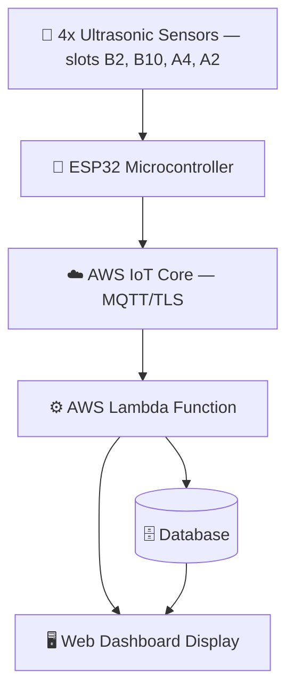
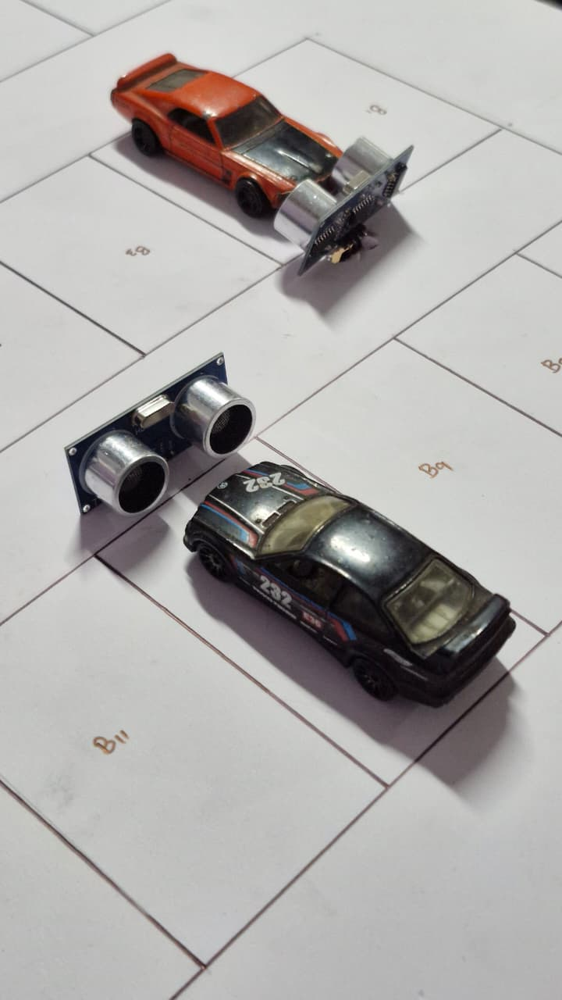
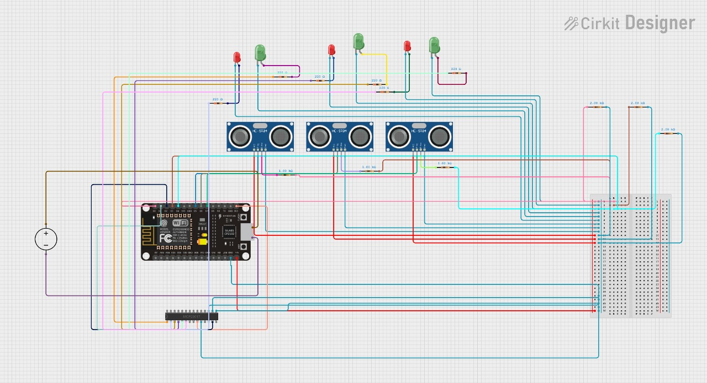

## 🚗 Smart Parking System using AWS


---

### 🧠 Overview

This project implements a **Smart Parking System** using **AWS IoT Core** to manage parking slot availability in real time.  
Four **ultrasonic sensors**, one per parking slot (`B2`, `B10`, `A4`, `A2`), detect vehicle presence and report occupancy changes to an **ESP32** microcontroller.  
The ESP32 connects to Wi-Fi, syncs time via NTP, and publishes slot-occupancy updates over **MQTT (TLS, X.509 certificate auth)** directly to **AWS IoT Core**.  
Downstream, AWS Lambda processes these events, writes the latest slot state to the database, and a web-based dashboard mirrors the physical parking lot layout, giving users real-time slot status within 2–3 seconds.

---

### 🏗️ System Architecture



---

### 🔄 Pipeline in Detail

1. **Sensing (ESP32):** each of the 4 ultrasonic sensors is polled in a loop (`getDistanceCM`). A slot is marked **occupied** when the measured distance drops below `distanceThresholdCM` (10cm), and **free** otherwise.
2. **Change detection (edge-triggered):** the firmware keeps the last known state per slot (`lastOccupied[4]`). A message is only published when a slot's occupancy actually *changes* — not on every poll — to minimize MQTT traffic and AWS costs.
3. **Publish (ESP32 → AWS IoT Core):** on a state change, the ESP32 builds a small JSON payload, e.g. `{"slotid":"B2","occupied":true}`, and publishes it over MQTT (port 8883, TLS with X.509 client cert) to the `parking/slots` topic on AWS IoT Core.
4. **Rule/trigger (AWS IoT Core):** an IoT Core topic rule subscribed to `parking/slots` invokes an **AWS Lambda function** for every incoming message.
5. **Processing + DB write (AWS Lambda):** the Lambda function parses the payload and **writes/updates the corresponding slot record in the database** (keyed by `slotid`), storing the current `occupied` state and a timestamp. This database is the single source of truth for "current parking lot state."
6. **Read path (Web Dashboard):** the web dashboard reads slot state from the database (either via a polling API call or a push mechanism) and renders it on a layout that mirrors the physical lot, so a user sees slot-level occupancy update within 2–3 seconds of a car arriving or leaving.

---

### 📸 Demo

| Hardware Setup | Circuit Diagram |
|---|---|
|  |  |

https://github.com/user-attachments/assets/e4762050-50a7-44a7-8dad-a95151c8a1e4

---

### 🔧 Firmware

[`firmware/smartparkingsystemesp32.ino`](firmware/smartparkingsystemesp32.ino) — ESP32 firmware: Wi-Fi + NTP sync, AWS IoT Core MQTT connection (TLS cert auth), per-slot ultrasonic polling, and change-triggered JSON publish to the `parking/slots` topic.

Requires a `secrets.h` (not committed) defining:
```cpp
#define WIFI_SSID         "..."
#define WIFI_PASSWORD     "..."
#define mqttEndpoint      "..."
#define rootCA            "..."
#define clientCRT         "..."
#define privateKey        "..."
```
